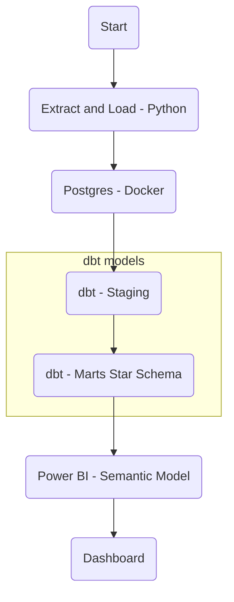

# 🛒 ELT Retail Analytics (Postgres + dbt + Power BI)

End-to-end **ELT pipeline** built around a classic analytics stack:

- **Python** for extraction + loading (raw → Postgres)
- **dbt** for transformations and a **Star Schema** (staging → marts)
- **Power BI** for the semantic model and executive dashboard

---

## 📊 Dashboard Preview


**Key Features:**

- Executive KPIs with sparklines and trend indicators
- Interactive time-series analysis with MoM comparisons
- Top 10 products by revenue
- Geographic market concentration analysis
- Professional gradient header with integrated filters

---

## 🧭 Architecture (ELT → dbt → BI)



**Pipeline Flow:**

```
Raw dataset (online_retail_II.xlsx)
      |
      v
Python loader (elt_step1_extract.py)
      |
      v
Postgres (schema: raw)
      |
      v
 dbt staging → dbt marts (star schema) → dbt reporting (KPIs)
      |
      v
Power BI semantic model + executive dashboard
```

---

## 📌 Data Scope

This project uses the **UCI Machine Learning Repository - Online Retail Dataset**:

- **Time period:** December 2009 - December 2011
- **Geographic scope:** Multiple countries (UK, France, Germany, EIRE, Spain, Netherlands, Belgium, etc.)
- **Transactions:** ~400K+ invoice lines after cleaning
- **Source:** [UCI Online Retail Dataset](https://archive.ics.uci.edu/dataset/352/online+retail)

The dataset is used in its **original form** (2009-2011 time period) to demonstrate the ELT pipeline architecture while maintaining data authenticity.

---

## 🧱 Star Schema (Analytics Marts)

### Fact Table

- `analytics_marts.fact_sales_star`
  - **Grain:** invoice line (invoice_no × stock_code × date × customer)
  - **Measures:** quantity, unit_price, line_amount
  - **Foreign keys:** customer_id, sales_date, stock_code, invoice_no

### Dimension Tables

- `analytics_marts.dim_date`
  - **Primary key:** date_day
  - **Attributes:** year, month, quarter, week, day_of_week, etc.

- `analytics_marts.dim_customers`
  - **Primary key:** customer_id
  - **Attributes:** country

- `analytics_marts.dim_products`
  - **Primary key:** stock_code
  - **Attributes:** description (product_description)

- `analytics_marts.dim_invoice`
  - **Primary key:** invoice_no
  - **Attributes:** invoice_day, is_cancelled

---

## 🕸️ dbt Lineage / Graph

The dbt graph screenshot is stored at: `assets/images/dbt_graph.png`


### How to regenerate dbt docs:

```bash
cd dbt_retail
uv run dbt docs generate --profiles-dir .
uv run dbt docs serve --profiles-dir .
# Open http://localhost:8080 → Lineage Graph → take a screenshot
```

---

## 🗂️ dbt Models (Overview)

### Source

- `source('raw', 'sales')` → Postgres schema: `raw`

### Staging Layer

- `stg_sales` — Standardizes column names, types, and cleans raw fields
  - Filters: quantity > 0, unit_price > 0, non-null invoice_no and customer_id
  - Computed fields: sales_date, line_amount

### Marts Layer (Star Schema)

**Fact:**

- `fact_sales_star` (grain: invoice line)

**Dimensions:**

- `dim_date` (time dimension)
- `dim_products` (product catalog)
- `dim_invoice` (invoice headers)
- `dim_customers` (customer geography)

### Reporting Layer (KPI Tables)

- `kpi_daily` — Daily aggregated metrics
- `kpi_product` — Product-level performance
- `kpi_customer` — Customer-level analysis
- `sales_star` — Flattened fact+dimensions view

---

## 📂 Project Structure

```text
ELT_retail_analytics/
├── data/
│   ├── raw/                      # online_retail_II.xlsx (source data)
│   └── processed/                # intermediate exports (optional)
├── dbt_retail/
│   ├── models/
│   │   ├── staging/              # stg_sales.sql
│   │   ├── marts/core/           # dims + facts (star schema)
│   │   └── reporting/            # KPI models / views
│   ├── macros/
│   ├── packages.yml
│   └── profiles.yml
├── powerbi/
│   ├── pbix/
│   │   └── retail_analytics_exec_dashboard.pbix
│   └── screenshots/
│       ├── pbi_model_star_schema.png
│       ├── pbi_measures_list.png
│       └── dashboard_final.png
├── assets/
│   └── images/
│       └── dbt_graph.png
├── sql/
│   └── init.sql                  # Database initialization script
├── docker-compose.yml
├── elt_step1_extract.py          # Python ETL script
├── .env.example
└── README.md
```

---

## ✅ Prerequisites

- **Docker + Docker Compose** (for Postgres)
- **Python 3.10+** (project uses a local virtualenv)
- **`uv`** package manager (or adapt commands to pip)
- **Power BI Desktop** (for dashboard visualization)

---

## ⚙️ Setup

### 1) Create your `.env`

Copy the example and fill values:

```bash
cp .env.example .env
```

Example `.env`:

```env
POSTGRES_USER=retail_user
POSTGRES_PASSWORD=retail_pass
POSTGRES_HOST=localhost
POSTGRES_PORT=5432
POSTGRES_DB=retail
```

### 2) Start Postgres (Docker)

```bash
docker compose up -d
```

Verify container is running:

```bash
docker ps
# Should show: retail_pg container
```

### 3) Initialize database schemas

```bash
docker exec -it retail_pg psql -U retail_user -d retail -f /sql/init.sql
```

This creates schemas: `raw`, `analytics_staging`, `analytics_marts`, `analytics_reporting`

---

## 🚀 Run the Pipeline

### Step 1: Extract + Load (Python → Postgres raw)

```bash
# Activate virtual environment (if using)
source .venv/Scripts/activate   # Windows Git Bash
# or
source .venv/bin/activate       # Linux/Mac

# Run extraction script
python elt_step1_extract.py
```

**What this does:**

- Reads `data/raw/online_retail_II.xlsx`
- Cleans data (removes nulls, negatives)
- Loads into `raw.sales` table in Postgres

**Expected output:**

```
📂 Reading: data/raw/online_retail_II.xlsx
✅ Loaded: ~540,000 lines
🧹 Cleaning data...
✅ After cleaning: ~400,000 lines
💾 Loading into Postgres (raw.sales)...
✅ 400,000+ lines loaded!
```

### Step 2: Build dbt models (staging → marts → reporting)

```bash
cd dbt_retail

# Load environment variables
set -a && source ../.env && set +a  # Linux/Mac/Git Bash
# or
set -o allexport; . ../.env; set +o allexport  # Alternative

# Run all dbt models
uv run dbt run --profiles-dir .

# Or run specific models:
uv run dbt run --profiles-dir . --select stg_sales dim_products dim_customers dim_date dim_invoice fact_sales fact_sales_star
```

**What this does:**

- Creates staging tables (`analytics_staging.stg_sales`)
- Builds star schema dimensions and facts (`analytics_marts.*`)
- Generates reporting tables (`analytics_reporting.*`)

### Step 3: Run dbt tests

```bash
uv run dbt test --profiles-dir .
```

**Tests verify:**

- Primary key uniqueness
- Not-null constraints
- Referential integrity (foreign keys)
- Data quality checks

Expected output:

```
Completed successfully
Done. PASS=X WARN=0 ERROR=0 SKIP=0
```

---

## 📊 Power BI — Semantic Model & Dashboard

### 1) Load Tables from Postgres

In Power BI Desktop:

1. **Get Data** → **PostgreSQL database**
2. **Server:** `localhost`
3. **Database:** `retail`
4. **Username:** `retail_user` (from .env)
5. **Password:** `retail_pass` (from .env)

Load these tables from `analytics_marts`:

- `analytics_marts.fact_sales_star`
- `analytics_marts.dim_date`
- `analytics_marts.dim_customers`
- `analytics_marts.dim_products`
- `analytics_marts.dim_invoice`

📸 Power BI star schema (Model view):  


---

### 2) Create Relationships (Model View)

Configure these relationships (Many-to-one, Single direction, Active):

- `fact_sales_star[customer_id]` → `dim_customers[customer_id]`
- `fact_sales_star[sales_date]` → `dim_date[date_day]`
- `fact_sales_star[stock_code]` → `dim_products[stock_code]`
- `fact_sales_star[invoice_no]` → `dim_invoice[invoice_no]`

**Important:** Ensure all relationships are:

- **Cardinality:** Many to One (\*)
- **Cross filter direction:** Single
- **Make this relationship active:** ✅ Checked

---

### 3) DAX Measures

Create a dedicated table called **Measures** (blank table) to store all measures.

📸 Measures list:  


#### Core Measures (Copy-Paste Ready):

```DAX
-- Revenue (Faturamento Total)
CA =
SUM ( 'analytics_marts_fact_sales_star'[line_amount] )

-- Orders / Invoices (Pedidos)
Commandes (Invoices) =
DISTINCTCOUNT ( 'analytics_marts_fact_sales_star'[invoice_no] )

-- Unique Customers (Clientes)
Clients =
DISTINCTCOUNT ( 'analytics_marts_fact_sales_star'[customer_id] )

-- Units Sold (Unidades)
Unités =
SUM ( 'analytics_marts_fact_sales_star'[quantity] )

-- Average Order Value (Ticket Médio)
AOV (€ / commande) =
DIVIDE ( [CA], [Commandes (Invoices)] )

-- Average Selling Price (Preço Médio Unitário)
ASP (€ / unité) =
DIVIDE ( [CA], [Unités] )

-- Revenue per Customer
CA / client =
DIVIDE ( [CA], [Clients] )

-- Distinct Products
Produits distincts =
DISTINCTCOUNT ( 'analytics_marts_fact_sales_star'[stock_code] )

-- Units per Order (Itens por Pedido)
Unités / commande =
DIVIDE ( [Unités], [Commandes (Invoices)] )

-- Previous Month Revenue
CA Mois précédent =
CALCULATE ( [CA], DATEADD ( 'analytics_marts_dim_date'[date_day], -1, MONTH ) )

-- Month-over-Month Change (%)
CA MoM % =
DIVIDE ( [CA] - [CA Mois précédent], [CA Mois précédent] )

-- Month-to-Date Revenue
CA MTD =
CALCULATE ( [CA], DATESMTD ( 'analytics_marts_dim_date'[date_day] ) )

-- Year-to-Date Revenue
CA YTD =
CALCULATE ( [CA], DATESYTD ( 'analytics_marts_dim_date'[date_day] ) )
```

#### Formatting Recommendations:

**For Currency Measures (CA, AOV, ASP, CA/client):**

1. Select the measure
2. **Measure tools** → **Format** → **Currency (€)**
3. **Decimal places:** 1-2 (depending on preference)

**For Percentage Measures (CA MoM %):**

1. Select the measure
2. **Format** → **Percentage**
3. **Decimal places:** 1

**For Count Measures (Commandes, Clients, Unités):**

1. **Format** → **Whole number**
2. **Thousands separator:** ✅ Checked

---

### 4) Dashboard Components

The executive dashboard includes:

#### Header Section

- Gradient background (#0078D4 → #004578)
- Title: "Retail Analytics Dashboard"
- Subtitle: "Visão Executiva | 2009-2011"
- Integrated filters: Date range (slicer), Country (slicer)

#### KPI Cards (with sparklines)

1. **Faturamento Total (CA Net)** — Total Revenue
   - Icon: 💰
   - Color: Blue (#0078D4)
   - Sparkline: Monthly trend
   - Indicator: MoM % change

2. **Pedidos Totais (Commandes Net)** — Total Orders
   - Icon: 📦
   - Color: Green (#107C10)
   - Sparkline: Monthly trend
   - Indicator: MoM % change

3. **Total Clientes (Clients)** — Unique Customers
   - Icon: 👥
   - Color: Purple (#8764B8)
   - Sparkline: Monthly trend
   - Indicator: MoM % change

4. **Ticket Médio (AOV Net)** — Average Order Value
   - Icon: 🎯
   - Color: Orange (#D83B01)
   - Sparkline: Monthly trend
   - Indicator: MoM % change

5. **Taxa Cancelamento** — Cancellation Rate
   - Icon: ⚠️
   - Color: Red (#A80000)
   - Sparkline: Monthly trend
   - Indicator: MoM % change

#### Main Chart

- **Type:** Line chart + Column chart (combo)
- **X-axis:** Month/Year (from dim_date)
- **Primary Y-axis:** CA Net (revenue)
- **Secondary Y-axis:** CA MoM % (month-over-month change)
- **Features:** Data labels, markers, gridlines

#### Top 10 Products

- **Type:** Horizontal bar chart
- **Category:** Product description
- **Value:** CA Net (revenue)
- **Filter:** Top 10 by revenue
- **Formatting:** Gradient color (light blue → dark blue)

#### Geographic Analysis

- **Type:** Donut chart or Map
- **Legend:** Country
- **Value:** CA Net (revenue)
- **Focus:** UK vs Others distribution

#### Detailed Table

- **Type:** Matrix or Table
- **Rows:** Country
- **Values:** CA Net, % of Total

#### Footer

- Dataset information: "UCI Online Retail (2009-2011)"
- Last update timestamp
- Pipeline description: "ELT demonstration (Python + dbt + Postgres + Power BI)"

---

### 5) Dashboard Best Practices Applied

✅ **Design:**

- Consistent color palette (blues, greens, purples, oranges)
- Rounded corners (8px) on all cards
- Subtle shadows for depth
- Gradient header for modern look
- Professional typography (Segoe UI family)

✅ **Layout:**

- Grid alignment (10px spacing)
- Clear visual hierarchy
- Generous white space
- Responsive to filters

✅ **Interactivity:**

- Cross-filtering between visuals
- Date range slicer
- Country slicer
- Drill-down capabilities (optional)

✅ **Data Integrity:**

- All KPIs verified against SQL queries
- Star schema ensures no duplicate counting
- Proper date hierarchies
- Consistent formatting

---

## 🔁 Refresh Logic (Important)

### When dbt rebuilds tables/views:

**In Power BI Desktop:**

1. **Home** → **Refresh** (standard refresh)
2. If column structure changed: **Transform data** → **Refresh Preview** → **Close & Apply**

### Troubleshooting Refresh Issues:

**Problem:** Power BI shows errors after dbt run  
**Solution:**

1. Close Power BI file
2. Delete cache: `C:\Users\<username>\AppData\Local\Microsoft\Power BI Desktop\AnalysisServicesWorkspaces`
3. Reopen file
4. Transform data → Refresh Preview → Close & Apply

**Problem:** Values seem incorrect  
**Solution:**

1. Verify in Postgres directly:
   ```sql
   SELECT SUM(line_amount) FROM analytics_marts.fact_sales_star;
   ```
2. Compare with Power BI's [CA] measure
3. Check for relationship issues in Model view

---

## 🧪 Notes / Gotchas

### Data Quality

- **For star schema relationships, dimension keys must be unique**
- If Power BI complains about duplicates, verify in Postgres:
  ```sql
  SELECT customer_id, COUNT(*)
  FROM analytics_marts.dim_customers
  GROUP BY customer_id
  HAVING COUNT(*) > 1;
  ```
  (Should return 0 rows)

### dbt Warnings

- You may see warnings about deprecated generic test syntax
- These are non-blocking and can be ignored (or update syntax to v2)

### Dataset Period

- Data is from **2009-2011** (historical dataset)
- This is intentional - demonstrates pipeline with real UCI data
- Add disclaimer in dashboard footer to set expectations

### Performance

- ~400K rows in fact table is manageable for Power BI
- If dataset grows significantly, consider:
  - Aggregation tables
  - Incremental dbt models
  - DirectQuery mode (instead of Import)

---

## 📌 Tech Stack

| Layer               | Technology                                     |
| ------------------- | ---------------------------------------------- |
| **Data Source**     | UCI Online Retail Dataset (Excel)              |
| **Extraction**      | Python (pandas, sqlalchemy)                    |
| **Database**        | PostgreSQL 16 (Docker)                         |
| **Transformation**  | dbt 1.8+                                       |
| **Visualization**   | Power BI Desktop                               |
| **Orchestration**   | Manual (can be automated with Airflow/Prefect) |
| **Version Control** | Git + GitHub                                   |

---

## 🎯 Future Enhancements

Potential improvements for this project:

- [ ] Add CI/CD pipeline for dbt tests (GitHub Actions)
- [ ] Implement incremental models for larger datasets
- [ ] Add data quality monitoring (dbt expectations)
- [ ] Create drill-through pages in Power BI
- [ ] Add Python script for automated refresh
- [ ] Implement row-level security in Power BI
- [ ] Add time intelligence calculations (YoY, QoQ)
- [ ] Create mobile-optimized dashboard layout
- [ ] Add anomaly detection for KPIs
- [ ] Implement data lineage documentation

---

## 📝 License & Attribution

- **Dataset:** [UCI Machine Learning Repository - Online Retail](https://archive.ics.uci.edu/dataset/352/online+retail)
- **License:** This project is for educational/demonstration purposes
- **Author:** [Your Name]
- **Year:** 2025

---

## 🙏 Acknowledgments

- UCI Machine Learning Repository for the Online Retail dataset
- dbt Community for excellent documentation
- Power BI community for visualization best practices

---

**📧 Questions or feedback?** Open an issue on GitHub or contact [rbmidolli@gmail.com]

**⭐ Like this project?** Give it a star on GitHub!
