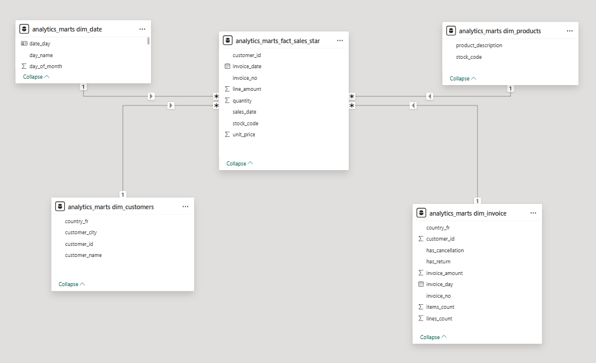
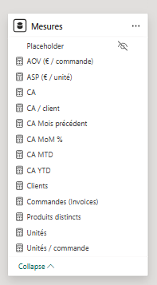
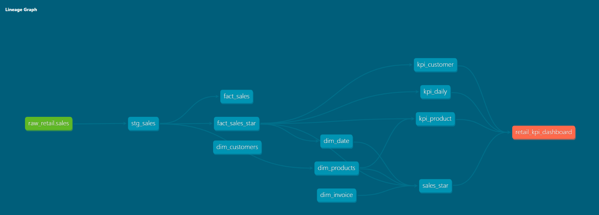

# 🛒 ELT Retail Analytics (Postgres + dbt + Power BI)

End-to-end **ELT pipeline** built with a classic analytics stack:

- **Python** for extraction + loading (**Excel → Postgres / raw**)
- **dbt** for transformations and a **Star Schema** (**staging → marts → reporting**)
- **Power BI** for the semantic model and an executive dashboard

---

## 📊 Power BI Model Preview

> Screenshot of the **star schema** in Power BI (Model view):



> Screenshot of the **DAX measures** list:



---

## 🧭 Architecture

### High-level flow

```mermaid
flowchart LR
  A["Online Retail II.xlsx"] --> B["Python load to Postgres"]
  B --> C[("Postgres<br/>schema: raw")]
  C --> D["dbt staging"]
  D --> E["dbt marts<br/>(star schema)"]
  E --> F["dbt reporting<br/>(KPIs / views)"]
  F --> G["Power BI semantic model"]
  G --> H["Executive dashboard"]
````

### Postgres schemas used in this project

* **raw**: source table loaded by Python (`raw.sales`)
* **staging**: dbt staging models (e.g., `staging.stg_sales`)
* **marts**: star-schema tables (e.g., `marts.fact_sales_star`, `marts.dim_*`)
* **analytics_reporting**: KPI tables / reporting views (e.g., `analytics_reporting.kpi_daily`)

---

## 📌 Dataset

This project uses the **Online Retail II** dataset (Excel file) stored in:

* `data/raw/online_retail_II.xlsx`

The dataset contains historical e-commerce transactions (2009–2011) across multiple countries.
Reference (UCI):

```text
https://archive.ics.uci.edu/ml/datasets/online%2Bretail%2BII
```

---

## 🧱 Star Schema (dbt marts)

### Fact table

* **`marts.fact_sales_star`**

  * **Grain:** invoice line (`invoice_no × stock_code × sales_date × customer_id`)
  * **Measures:** `quantity`, `unit_price`, `line_amount`
  * **Keys:** `customer_id`, `sales_date`, `stock_code`, `invoice_no`
  * **Flags:** `is_cancelled`

### Dimensions

* **`marts.dim_date`**

  * **PK:** `date_day`
  * **Attributes (examples):** `year`, `month`, `dow`, `iso_week`, `month_start`

* **`marts.dim_products`**

  * **PK:** `stock_code`
  * **Attributes:** `product_description`, `is_product`

* **`marts.dim_customers`**

  * **PK:** `customer_id`
  * **Attributes:** `country`

* **`marts.dim_invoice`**

  * **PK:** `invoice_no`
  * **Attributes:** `invoice_day`, `invoice_ts`, `is_cancelled`

---

## 🕸️ dbt Lineage Graph

The lineage graph screenshot is stored at:

* `assets/images/dbt_graph.png`



### Regenerate dbt docs + lineage

```bash
cd dbt_retail

# load env vars for dbt connection
set -o allexport; . ../.env; set +o allexport

uv run dbt docs generate --profiles-dir . --no-partial-parse
uv run dbt docs serve --profiles-dir . --port 8080
# open http://localhost:8080 → Lineage Graph → take a screenshot
```

---

## 🗂️ dbt Models (overview)

### Source

* `source('raw_retail', 'sales')` → table **`raw.sales`**

Source definition is in:

* `dbt_retail/models/staging/sources.yml`

### Staging

* **`staging.stg_sales`**

  * Standardizes types and column names
  * Computes `sales_date` and `line_amount`
  * Filters obvious invalid records (e.g., null identifiers, non-positive values)

### Marts

Core marts (star schema):

* `marts.fact_sales`
* `marts.fact_sales_star`
* `marts.dim_date`
* `marts.dim_products`
* `marts.dim_invoice`
* `marts.dim_customers`

### Reporting

* `analytics_reporting.kpi_daily`
* `analytics_reporting.kpi_product`
* `analytics_reporting.kpi_customer`
* `analytics_reporting.sales_star` (flattened view for exploration)
* Exposure: `retail_kpi_dashboard`

---

## 📂 Project Structure

```text
ELT_retail_analytics/
├── data/
│   ├── raw/
│   │   └── online_retail_II.xlsx
│   └── processed/                 # optional local exports (not required by pipeline)
├── src/
│   └── load_raw_online_retail.py  # core loader logic
├── elt_step1_extract.py           # pipeline step: Excel → Postgres/raw
├── sql/
│   └── init.sql                   # schema/bootstrap SQL
├── docker-compose.yml
├── dbt_retail/
│   ├── dbt_project.yml
│   ├── profiles.yml
│   ├── models/
│   │   ├── staging/
│   │   │   ├── sources.yml
│   │   │   └── stg_sales.sql
│   │   ├── marts/core/
│   │   └── reporting/
│   └── target/                    # generated by dbt docs/compile
├── powerbi/
│   ├── retail_analytics_exec_dashboard.pbix
│   ├── elt_retail_analytics.pbix
│   └── screenshots/
│       ├── pbi_model_star_schema.png
│       └── pbi_measures_list.png
└── assets/
    └── images/
        └── dbt_graph.png
```

---

## ✅ Prerequisites

* **Docker + Docker Compose** (Postgres)
* **Python 3.10+**
* **uv** (Python package manager)
* **Power BI Desktop** (for the BI part)

---

## ⚙️ Setup

### 1) Create your `.env`

```bash
cp .env.example .env
```

Example:

```env
POSTGRES_USER=retail_user
POSTGRES_PASSWORD=retail_pass
POSTGRES_HOST=localhost
POSTGRES_PORT=5432
POSTGRES_DB=retail
```

### 2) Start Postgres (Docker)

```bash
docker compose up -d
docker ps
```

### 3) Initialize schemas

```bash
docker exec -it retail_pg psql -U retail_user -d retail -f /sql/init.sql
```

---

## 🚀 Run the pipeline

### Step 1 — Extract + Load (Python → Postgres/raw)

From repository root:

```bash
uv sync
uv run python elt_step1_extract.py
```

What it does:

* Reads `data/raw/online_retail_II.xlsx`
* Cleans obvious invalid rows (null IDs, negative/zero quantities or prices)
* Loads to **`raw.sales`** in Postgres

### Step 2 — Transform (dbt)

```bash
cd dbt_retail
set -o allexport; . ../.env; set +o allexport

uv run dbt run --profiles-dir .
```

Build a specific subset (example):

```bash
uv run dbt run --profiles-dir . --select stg_sales fact_sales fact_sales_star dim_date dim_products dim_invoice dim_customers
```

### Step 3 — Test (dbt)

```bash
uv run dbt test --profiles-dir .
```

---

## 📊 Power BI — Semantic model & dashboard

### 1) Connect to Postgres

In Power BI Desktop:

* **Get Data → PostgreSQL database**
* Server: `localhost`
* Database: `retail`
* Credentials: from `.env`

Load tables from these schemas:

* `marts`: `fact_sales_star`, `dim_date`, `dim_customers`, `dim_products`, `dim_invoice`
* (optional) `analytics_reporting`: `kpi_daily`, `kpi_product`, `kpi_customer`, `sales_star`

### 2) Relationships (Model view)

Create active relationships (Many-to-one, Single direction):

* `fact_sales_star[customer_id]` → `dim_customers[customer_id]`
* `fact_sales_star[sales_date]` → `dim_date[date_day]`
* `fact_sales_star[stock_code]` → `dim_products[stock_code]`
* `fact_sales_star[invoice_no]` → `dim_invoice[invoice_no]`

---

## 🧮 DAX Measures (copy/paste)

In the provided PBIX, table names may appear with a schema prefix (example: `marts_fact_sales_star`).
If your model uses different names, replace them in the measures below.

```DAX
-- Revenue
CA =
SUM ( 'marts_fact_sales_star'[line_amount] )

-- Orders / Invoices
Commandes (Invoices) =
DISTINCTCOUNT ( 'marts_fact_sales_star'[invoice_no] )

-- Unique customers
Clients =
DISTINCTCOUNT ( 'marts_fact_sales_star'[customer_id] )

-- Units sold
Unités =
SUM ( 'marts_fact_sales_star'[quantity] )

-- Average order value
AOV (€ / commande) =
DIVIDE ( [CA], [Commandes (Invoices)] )

-- Average selling price
ASP (€ / unité) =
DIVIDE ( [CA], [Unités] )

-- Revenue per customer
CA / client =
DIVIDE ( [CA], [Clients] )

-- Distinct products
Produits distincts =
DISTINCTCOUNT ( 'marts_fact_sales_star'[stock_code] )

-- Units per order
Unités / commande =
DIVIDE ( [Unités], [Commandes (Invoices)] )

-- Cancellation rate (by invoices)
Taux d'annulation =
DIVIDE (
    CALCULATE (
        DISTINCTCOUNT ( 'marts_fact_sales_star'[invoice_no] ),
        'marts_fact_sales_star'[is_cancelled] = TRUE ()
    ),
    [Commandes (Invoices)]
)

-- Previous month revenue
CA Mois précédent =
CALCULATE ( [CA], DATEADD ( 'marts_dim_date'[date_day], -1, MONTH ) )

-- Month-over-month change (%)
CA MoM % =
DIVIDE ( [CA] - [CA Mois précédent], [CA Mois précédent] )
```

---

## 🔁 Refresh notes

After running dbt:

* In Power BI Desktop: **Home → Refresh**
* If columns changed: **Transform data → Refresh Preview → Close & Apply**

---

## 🧪 Troubleshooting

### dbt is not found

Use the project runner consistently:

```bash
cd dbt_retail
uv run dbt --version
```

### Verify data in Postgres

```sql
SELECT COUNT(*) FROM raw.sales;
SELECT SUM(line_amount) FROM marts.fact_sales_star;
```

---

## 📌 Tech stack

* **Source:** Online Retail II (Excel)
* **ELT:** Python + Postgres (Docker)
* **Transformations:** dbt
* **BI:** Power BI Desktop
* **Version control:** Git + GitHub

---

## 🧭 Roadmap (optional)

* Add CI (GitHub Actions) for `dbt build` + `dbt test`
* Add incremental models for larger datasets
* Add automated refresh script for local runs
* Extend time-intelligence measures (YoY, rolling windows)

---

## 📝 Attribution

Dataset reference:

```text
https://archive.ics.uci.edu/ml/datasets/online%2Bretail%2BII
```

Author: Rafael Midolli
