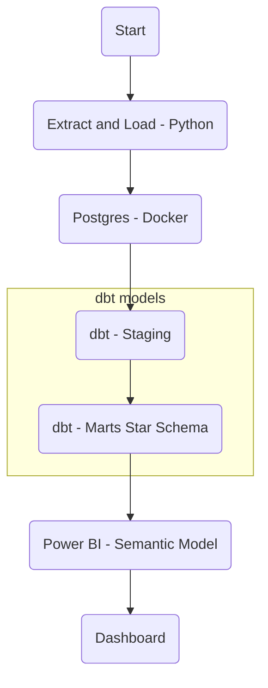

🛒 ELT Retail Analytics (Postgres + dbt + Power BI)

End-to-end **ELT pipeline** built around a classic analytics stack:

- **Python** for extraction + loading (raw → Postgres)
- **dbt** for transformations and a **Star Schema** (staging → marts)
- **Power BI** for the semantic model and dashboard layer

---

## 🧭 Architecture (ELT → dbt → BI)



---

## 📌 Data scope

This dataset is filtered to:

- **France**
- **Europe (Others)**

(confirmed directly from `analytics_staging.stg_sales`).

---

## 🧱 Star Schema (Analytics Marts)

**Fact**

- `analytics_marts.fact_sales_star`
  Grain: **invoice line** (invoice_no × stock_code × date × customer)

**Dimensions**

- `analytics_marts.dim_date`
- `analytics_marts.dim_customers`
- `analytics_marts.dim_products`
- `analytics_marts.dim_invoice`

---

## 🕸️ dbt lineage / graph

The dbt graph screenshot is stored at: `assets/images/dbt_graph.png`


How it was produced (example):

```bash
cd dbt_retail
uv run dbt docs generate --profiles-dir .
uv run dbt docs serve --profiles-dir .
```

---

## 📂 Project structure

```text
ELT_retail_analytics/
├── data/
│   ├── raw/                      # source file(s) (optional in repo)
│   └── processed/                # filtered / processed exports (optional in repo)
├── dbt_retail/
│   ├── models/
│   │   ├── staging/              # stg_sales
│   │   ├── marts/core/           # dims + facts (star schema)
│   │   └── reporting/            # KPI models / views
│   ├── macros/
│   └── packages.yml
├── powerbi/
│   ├── pbix/
│   └── screenshots/
├── assets/
│   └── images/
│       └── dbt_graph.png
├── sql/
│   └── init.sql
├── docker-compose.yml
├── elt_step1_extract.py
├── .env.example
└── README.md
```

---

## ✅ Prerequisites

- Docker + Docker Compose
- Python (project uses a local virtualenv)
- `uv` installed (or adapt commands to pip)

---

## ⚙️ Setup

### 1) Create your `.env`

Copy the example and fill values:

```bash
cp .env.example .env
```

### 2) Start Postgres (Docker)

```bash
docker compose up -d
```

(Optional) verify container:

```bash
docker ps
```

### 3) Create schema / objects (if needed)

```bash
docker exec -it retail_pg psql -U retail_user -d retail -f /sql/init.sql
```

---

## 🚀 Run the pipeline

### 1) Extract + Load (Python → Postgres raw)

```bash
source .venv/Scripts/activate   # Windows Git Bash
python elt_step1_extract.py
```

### 2) Build models with dbt (staging → marts)

```bash
cd dbt_retail
set -a && source ../.env && set +a

uv run dbt run --profiles-dir . --select stg_sales dim_products dim_customers dim_date dim_invoice fact_sales fact_sales_star
```

### 3) Run tests

```bash
uv run dbt test --profiles-dir .
```

---

## 📊 Power BI — Semantic model & measures (WIP)

> This section documents only the **Power BI semantic model (star schema) and DAX measures**. The dashboard/layout will be documented later.

### 1) Load tables from Postgres

In Power BI Desktop:

1. **Get Data → PostgreSQL**
2. Load (from `analytics_marts`):
   - `analytics_marts.fact_sales_star`
   - `analytics_marts.dim_date`
   - `analytics_marts.dim_customers`
   - `analytics_marts.dim_products`
   - `analytics_marts.dim_invoice`

📸 Power BI star schema (Model view):  


### 2) Relationships (Model view)

Create relationships (Many-to-one, Single direction, Active):

- `fact_sales_star[customer_id]` → `dim_customers[customer_id]`
- `fact_sales_star[sales_date]` → `dim_date[date_day]`
- `fact_sales_star[stock_code]` → `dim_products[stock_code]`
- `fact_sales_star[invoice_no]` → `dim_invoice[invoice_no]`

### 3) Measures (DAX)

Measures are stored in a dedicated table **Measures**.

📸 Measures list:  


**Main measures (implemented):**

- `CA`
- `Commandes (Invoices)`
- `Clients`
- `Unités`
- `AOV (€ / commande)`
- `ASP (€ / unité)`
- `CA / client`
- `Produits distincts`
- `Unités / commande`
- `CA Mois précédent`
- `CA MoM %`
- `CA MTD`
- `CA YTD`

**DAX reference (reproducible):**

```DAX
-- Revenue
CA =
SUM ( 'analytics_marts_fact_sales_star'[line_amount] )

-- Orders (distinct invoices)
Commandes (Invoices) =
DISTINCTCOUNT ( 'analytics_marts_fact_sales_star'[invoice_no] )

-- Customers (distinct customers)
Clients =
DISTINCTCOUNT ( 'analytics_marts_fact_sales_star'[customer_id] )

-- Units (quantity)
Unités =
SUM ( 'analytics_marts_fact_sales_star'[quantity] )

-- Average Order Value
AOV (€ / commande) =
DIVIDE ( [CA], [Commandes (Invoices)] )

-- Average Selling Price
ASP (€ / unité) =
DIVIDE ( [CA], [Unités] )

-- Revenue per customer
CA / client =
DIVIDE ( [CA], [Clients] )

-- Distinct products
Produits distincts =
DISTINCTCOUNT ( 'analytics_marts_fact_sales_star'[stock_code] )

-- Units per order
Unités / commande =
DIVIDE ( [Unités], [Commandes (Invoices)] )

-- Previous month revenue
CA Mois précédent =
CALCULATE ( [CA], DATEADD ( 'analytics_marts_dim_date'[date_day], -1, MONTH ) )

-- MoM evolution
CA MoM % =
DIVIDE ( [CA] - [CA Mois précédent], [CA Mois précédent] )

-- Month-to-date revenue
CA MTD =
CALCULATE ( [CA], DATESMTD ( 'analytics_marts_dim_date'[date_day] ) )

-- Year-to-date revenue
CA YTD =
CALCULATE ( [CA], DATESYTD ( 'analytics_marts_dim_date'[date_day] ) )
```

### 4) Formatting notes

- `CA` is formatted as **Currency (€)** (Measure tools → Format) to ensure consistent display across visuals and tooltips.
- Decimal places can be set to `0–2` depending on the desired precision.

---

## 🔁 Refresh logic (important)

When dbt rebuilds tables/views:

- In Power BI Desktop: **Home → Refresh**
- If columns changed (new fields): **Transform data → Refresh Preview → Close & Apply**

---

## 🧪 Notes / gotchas

- For star schema relationships, dimension keys must be **unique**.
- If Power BI complains about duplicates, it can be cache/preview.
  The source-of-truth check is in Postgres (dbt tests / SQL checks).

---

## 📌 Tech stack

- Postgres (Docker)
- dbt
- Python
- Power BI
